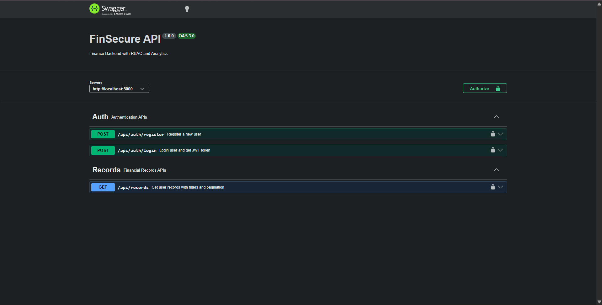
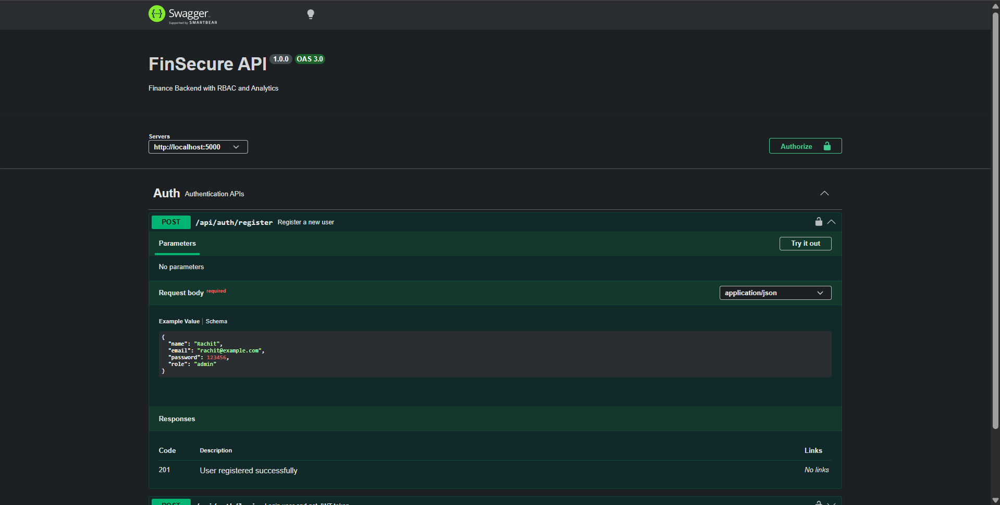
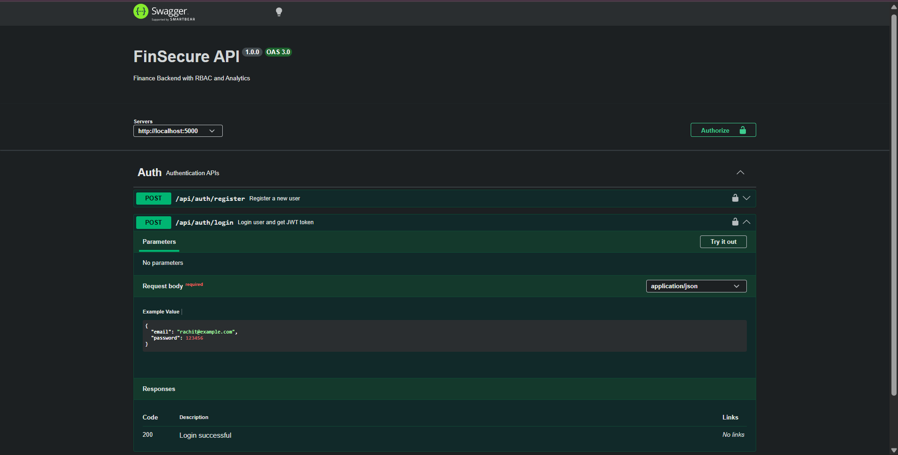
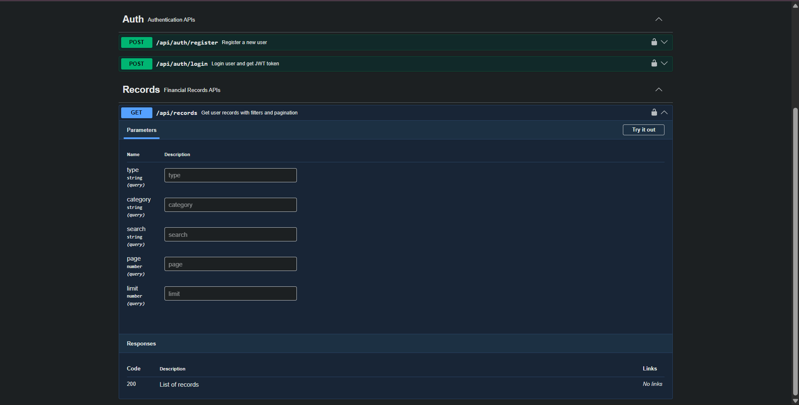

# FinSecure — Finance Data Processing & Access Control Backend

* authentication
* role-based access control
* financial records
* analytics dashboard

---

## Screenshots

| Overview | Auth APIs |
|----------|----------|
|  |  |

| Login Flow | Records API |
|-----------|-------------|
|  |  |

---

## Key Engineering Highlights

* **JWT-based authentication + RBAC system**
* Clean, scalable backend architecture (MVC pattern)
* Advanced analytics using MongoDB aggregation
* Search, filtering, and pagination support
* Rate limiting + secure API design
* Soft delete for data safety and recovery
* Swagger-powered interactive API documentation

---

## Core Features

### User & Role Management

* Register & login system
* Roles: **Viewer, Analyst, Admin**
* Strict role-based permissions

---

### Financial Records

* Admin-controlled record creation
* User-specific data isolation
* Full CRUD operations
* Filters:

  * type (income/expense)
  * category
  * date range

---

### Dashboard Analytics

* Total income / expenses
* Net balance calculation
* Category-wise breakdown
* Monthly trends (graph-ready)
* Recent activity feed

---

## Access Control Model

| Role    | Create | Read | Update | Delete |
| ------- | ------ | ---- | ------ | ------ |
| Viewer  | No      | Yes    | No     | No      |
| Analyst | No      | Yes    | No     | No      |
| Admin   | Yes     | Yes    | Yes    | Yes     |

---

## Setup

```bash
git clone https://github.com/your-username/FinSecure.git
cd FinSecure/backend
npm install
npm run dev
```

---

## Environment Variables

```env
PORT=5000
MONGO_URI=your_mongodb_connection
JWT_SECRET=your_secret_key
```

---

## API Docs

Swagger UI available at:

```
http://localhost:5000/api-docs
```

---

## Future Enhancements

* API testing with unit/integration tests
* Export reports (CSV/PDF)
* Role-based dashboards (frontend ready)
* Deployment (Docker / Cloud)

---

## Contribution

Open to feedback and improvements. Feel free to fork and contribute!

---

## Contact

**Rachit**
GitHub: https://github.com/Rachit753
LinkedIn: https://www.linkedin.com/in/rachit-chauhan/

---

## Support

If you found this project useful, consider giving it a ⭐.